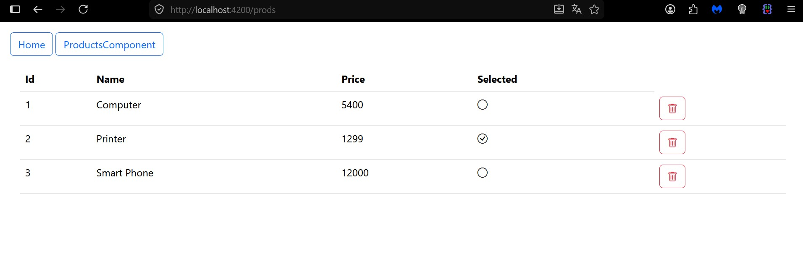

# 📘 Compte Rendu : TP3 – Angular 19 & Spring Boot REST API

## 1. Introduction

Ce TP consiste à développer une application frontend avec Angular 19 communiquant avec une API REST Spring Boot dédiée à la gestion de produits.

L’objectif principal est de mettre en pratique les concepts fondamentaux d’Angular : composants standalone, services, injection de dépendances et communication HTTP avec un backend.

---

## 2. Technologies utilisées

- Angular 19
- Spring Boot
- REST API
- Swagger UI
- Bootstrap Icons

---

## 3. Architecture technique de la solution

### A. Architecture globale

Le projet respecte une architecture client-serveur avec une séparation claire des responsabilités :

- **Frontend (Angular 19)** : gère l’interface utilisateur, les événements et l’affichage des données.
- **Backend (Spring Boot)** : expose une API REST sur le port **8083** avec les endpoints CRUD pour les produits.
- **Communication** : échange de données JSON via le protocole HTTP.

### B. Composants Angular

| Composant | Rôle | Éléments clés |
|----------|------|---------------|
| `ProductsComponent` | Affiche la liste des produits dans un tableau HTML | `*ngFor`, `subscribe()`, event binding (`delete`) |
| `ProductService` | Encapsule les appels API REST | `HttpClient`, `Observable`, méthodes `getAllProducts()` et `deleteProduct()` |

### C. Service et injection de dépendances

Le service `ProductService` est injecté au niveau racine (`providedIn: 'root'`) et utilise `HttpClient` pour interagir avec le backend.

```typescript
@Injectable({ providedIn: 'root' })
export class ProductService {
  constructor(private http: HttpClient) {}

  getAllProducts(): Observable<any> {
    return this.http.get('http://localhost:8083/products');
  }

  deleteProduct(product: any): Observable<any> {
    return this.http.delete('http://localhost:8083/products/' + product.id);
  }
}
```

---

## 4. Fonctionnalités implémentées

### A. Affichage des produits

Le composant `ProductsComponent` appelle le service au chargement (`ngOnInit`) pour récupérer la liste des produits via `subscribe()` puis les stocke dans une variable locale `products`.

| Élément | Description |
|--------|-------------|
| Méthode HTTP | `GET http://localhost:8083/products` |
| Framework | `Observable`, `subscribe` |
| Affichage | Tableau HTML avec `*ngFor` |
| Icônes | Bootstrap Icons pour l’interface utilisateur |

### B. Suppression d’un produit

Chaque ligne du tableau contient un bouton **Delete** qui déclenche la méthode `handleDeleteProduct(product)`.



```typescript
handleDeleteProduct(product: any) {
  this.productService.deleteProduct(product).subscribe({
    next: () => this.getAllProducts(),
    error: (err) => console.log(err)
  });
}
```

### C. Configuration du client HTTP

Le fichier `app.config.ts` active le client HTTP pour toute l’application.

```typescript
export const appConfig: ApplicationConfig = {
  providers: [
    provideRouter(routes),
    provideHttpClient()
  ]
};
```

### D. Routage et navigation

L’application intègre un système de routage via `app.routes.ts`, permettant la navigation entre les différentes vues.

### E. Documentation API avec Swagger UI

Le projet est relié au backend Spring Boot et utilise **Swagger UI** pour documenter et tester les endpoints REST.

---

## 5. Intégration avec le backend Spring Boot

### A. Endpoints attendus du backend

| Méthode | URL | Description |
|--------|-----|-------------|
| `GET` | `/products` | Retourne la liste des produits au format JSON |
| `DELETE` | `/products/{id}` | Supprime un produit par son identifiant |

### B. Configuration CORS (côté Spring Boot)

Pour permettre la communication entre Angular (port **4200**) et Spring Boot (port **8083**), le backend doit inclure l’annotation `@CrossOrigin`.

```java
@RestController
@CrossOrigin("*")
public class ProductRestController {
    // ...
}
```

## 6. Dépendances principales

| Dépendance | Version | Utilité |
|-----------|---------|---------|
| `@angular/core` | 19.x | Framework Angular |
| `@angular/common` | 19.x | HttpClient, directives communes |
| `@angular/router` | 19.x | Routage et navigation |
| `bootstrap-icons` | Latest | Icônes de l’interface utilisateur |

---

## 8. Compétences acquises

- Création d’un projet Angular 19 avec composants standalone
- Injection de dépendances et création de services
- Communication HTTP avec `HttpClient`
- Manipulation des données asynchrones avec `Observable` et `subscribe`
- Intégration frontend/backend via API REST
- Gestion des erreurs et résolution des problèmes CORS
- Utilisation de Swagger UI pour la documentation API
- Intégration d’icônes Bootstrap

---

## 9. Conclusion

Ce TP a permis de mettre en pratique les concepts fondamentaux d’Angular 19 dans le cadre d’une application réelle communiquant avec une API REST Spring Boot.

La combinaison d’Angular pour le frontend et de Spring Boot pour le backend illustre une architecture moderne de type **full-stack**, largement utilisée dans les applications d’entreprise.

L’utilisation de **Swagger UI** facilite la documentation et le test des endpoints REST, tandis que l’intégration de **Bootstrap Icons** améliore l’expérience utilisateur.

La séparation claire des couches (**présentation**, **service**, **API**) facilite la maintenance et l’évolution du projet.
